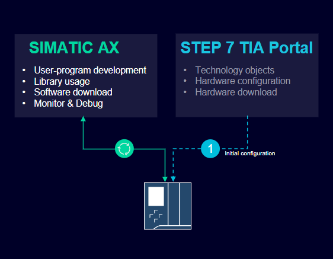

# SIMATIC AX sideloading tutorial

In this tutorial, you'll learn how to program, download and debug a S7-1500 PLC with SIMATIC AX.
The main goal of this tutorial is to get familiar with the sideloading workflow in AX and basics of the AX IDE.

> Note: The scope of the tutorial is limited to the sideloading workflow

After this tutorial, you will:

- know how to navigate the AX IDE
- know the basics about the Apax package manager
- understand the steps required for the sideloading workflow with AX
- be able to create a new AX project
- be familair with the AX project structure
- know how to compile and download the PLC code
- be able to write a basic plc program in structured text
- be able to write simple test cases with the AX testing framework
- be able to debug your PLC program from the AX IDE
- know where to find more detailed information about AX

This tutorial is structured in multiple sequential chapters, which can be used as reference.

> Note: Although this tutorial focuses on the local IDE, the workflow is very similar in the cloud IDE.

## Training chapters
> **Tip**: In each chapter the headers are marked with a icon, the :mortar_board: icon indicates learning goals, the :information_source: icon indicates a information section, the :raised_hands: icon indicates a hands-on section.

- [0. Navigating AX](./doc/0-navigating.md) :arrow_left:(Start here)
- [1. Setting up a project using the Apax package manager](./doc/1-setup.md)
- [2. Write your application in ST](./doc/2-coding.md)
- [3. Usage of the testing framework](./doc/3-testing.md)
- [4. Build and download the application](./doc/4-download.md)
- [5. Debugging the program](./doc/5-debug.md)
- [6. Do It Yourself (create your own application)](./doc/6-diy.md)

### Bonus chapters

- [Study the AX Community Github](https://github.com/simatic-ax)

## Prerequisites

During this tutorial the following prerequisites are required.

- an configured AX account
- a configured github account **(Optional)**
  - [how to get your public key from AX](https://console.simatic-ax.siemens.io/docs/axcode/source-code-management)
  - [how to add a SSH key on GitHub](https://docs.github.com/en/authentication/connecting-to-github-with-ssh/adding-a-new-ssh-key-to-your-github-account)
  - > Note: you need this public key to be able to clone the repository in the cloud IDE
    >
- an installation of the offline AX IDE logged in to APAX (using apax login)
- installed the [prerequisites for AX](https://console.simatic-ax.siemens.io/docs/get-started/prerequisites)
- locally configured Git install (Optional)
- TIA portal V18> installation
- PLCSIM Advanced or physical s7-1500 with a loaded hardware configuration

## Additional information

- This tutorial was inspiration for creating the simatic-ax-tutorial: [standardizer-tutorial-lib](https://github.com/simatic-ax/standardizer-tutorial-lib)
- [The AX website](https://axcite.me) (login required)
- [The AX Community Github](https://github.com/simatic-ax)
- [The SIOS overview page](https://support.industry.siemens.com/cs/document/109815017)

## Contribution

Thanks for your interest in contributing. Anybody is free to report bugs, unclear documentation, and other problems regarding this repository in the Issues section or, even better, propose any changes to this repository using Pull Requests.

## License and Legal information

Please read the [Legal information](LICENSE.md)
