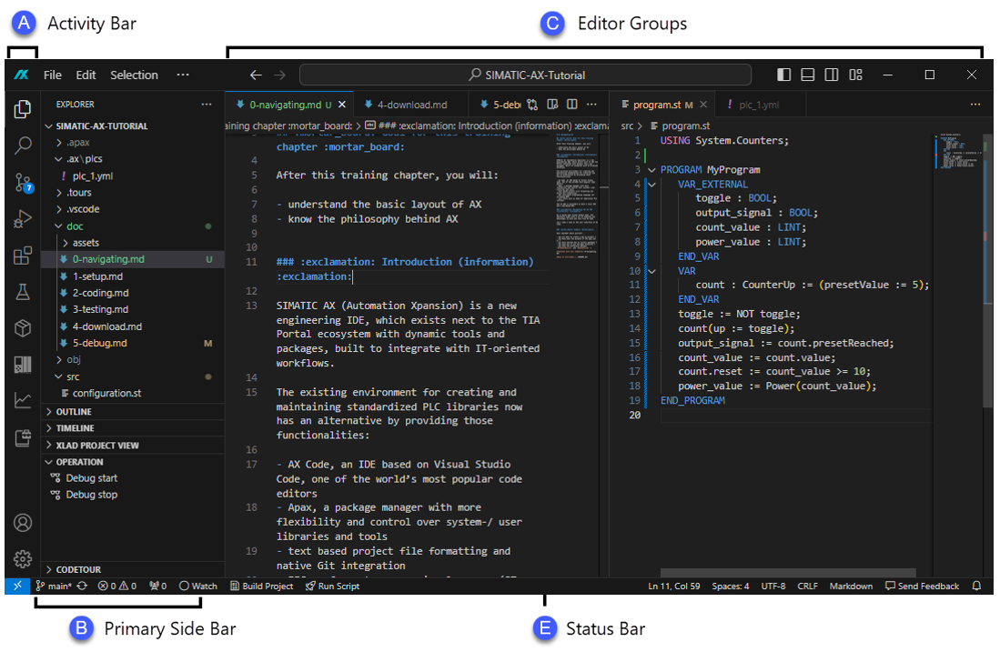
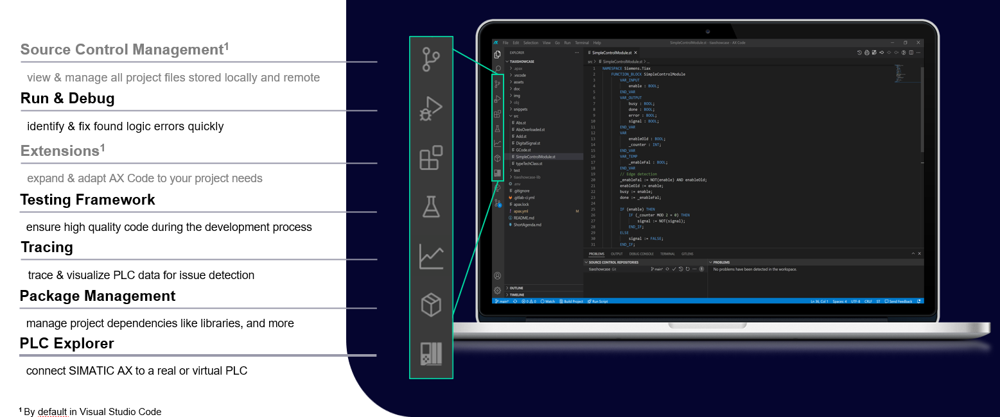

# 0. Navigating AX

## :mortar_board: Goal for this training chapter :mortar_board:

After this training chapter, you will:

- understand the basic layout of AX
- know the philosophy behind AX

### :information_source: Introduction (information) :information_source:

SIMATIC AX (Automation Xpansion) is a new engineering IDE, which exists next to the TIA Portal ecosystem. The AX IDE is equiped with dynamic tools and packages, built to integrate with IT-oriented workflows. The AX IDE offers a familiar environment for most new employees and IT programmers.

The existing environment for creating and maintaining standardized PLC libraries now has an alternative by providing those functionalities:

- AX Code, an IDE based on Visual Studio Code, one of the world’s most popular code editors.
- Apax, a package manager with more flexibility and control over system-/ user libraries and tools.
- text based project file formatting and native Git integration.
- IEC conformant programming language (ST including OOP).
- unit tests with no need for additional PLC runtimes.

The AX IDE is available as both a [local IDE](https://console.simatic-ax.siemens.io/downloads) and a [web-based IDE](https://console.simatic-ax.siemens.io/workspaces).

### :information_source: Navigating the AX IDE (information) :information_source:

AX is based upon Visual Studio Code, and therefore comes with a lot of features and advantages we know and love from VS Code.

let's take a look at the user interface of AX code;

- Editor - The main area to edit your files. You can open as many editors as you like side by side vertically and horizontally.
- Primary Side Bar - Contains different views like the Explorer to assist you while working on your project.
Status Bar - Information about the opened project and the files you edit.
- Activity Bar - Located on the far left-hand side. Lets you switch between views and gives you additional context-specific indicators, like the number of outgoing changes when Git is enabled. You can change the position of the Activity Bar. 
- Panel - An additional space for views below the editor region. By default, it contains output, debug information, errors and warnings, and an integrated terminal. The Panel can also be moved to the left or right for more vertical space.

For more in-depth information about the GUI check the [Visual Studio Code docs](https://code.visualstudio.com/docs/getstarted/userinterface).

### :information_source: AX specific Activities (information) :information_source:

Most of the functionality that is specific for AX is accesed through the activity bar. From top to bottom we'll find the following activities in the AX IDE by default;
- [Explorer](https://code.visualstudio.com/docs/getstarted/userinterface) - Here you can acces the workspace filesystem.
- [Search](https://code.visualstudio.com/docs/getstarted/userinterface) - Search the project for anything.
- [Source Control](https://code.visualstudio.com/docs/sourcecontrol/overview) - Provides GIT versioning and source control integration for your complete project. 
- [Run and Debug](https://console.simatic-ax.siemens.io/docs/plc-debugging) - Enables debugging of the code on actual hardware or simulated PLC's.
- [Extensions](https://code.visualstudio.com/docs/editor/extension-marketplace) - The extension market, install your favorite VS code extensions into AX code.
- [Testing](https://console.simatic-ax.siemens.io/docs/axunitst) - AX specific functionality, provides a overview of test cases present in the project. Enables running the tests and shows the test results.
- [Tracing](https://console.simatic-ax.siemens.io/docs/tracing) - AX specific functionality, enables tracing of the variables in the PLC and presents them into a graph.
- [Apax](https://console.simatic-ax.siemens.io/docs/apax) - The Apax package manager GUI, a AX specific function. Enables installing packages with libraries or functionalities for your project.
- [PLC Explorer](https://console.simatic-ax.siemens.io/docs/axcode/plc-explorer#plc-explorer) - AX specific, Navigate remote PLC's, trace or download them. 

All AX functionalities can also be called using the intergrated terminal of the AX IDE. The intergrated terminal can be accesed with; *ctrl+shift+`*. 

### :mortar_board: Summary :mortar_board:

Goal reached? Check yourself...

- you have a overview of the general layout of the AX IDE✔
- you know how to navigate the AX IDE ✔

[Continue with next chapter](./1-setup.md)

[Back to overview](./../README.md)
