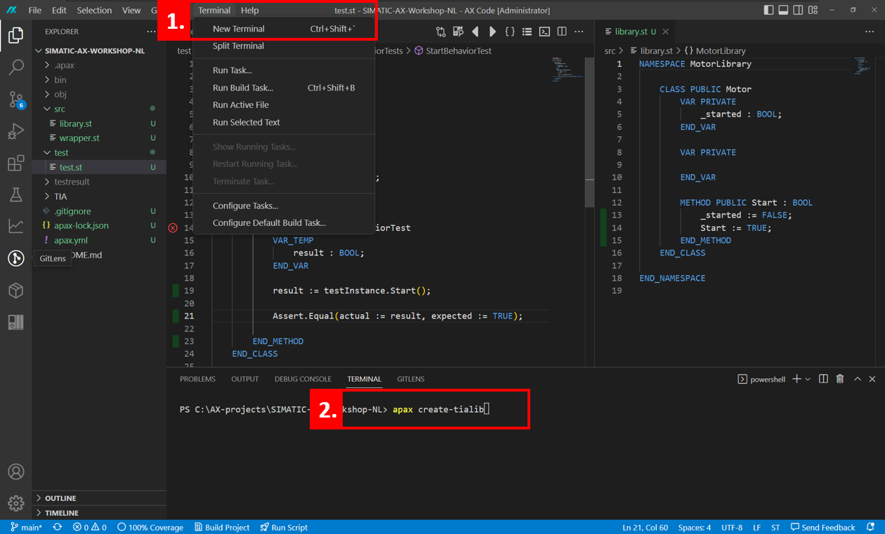

# 3. Creating a TIA portal Library

## :mortar_board: Goal for this training chapter :mortar_board:

After this training chapter, you will:

- know the basic workflow to create a TIA portal library from a TIAX project
- import the library in to TIA portal
- know that libraries in TIA portal that are imported from AX are write protected

### :raised_hands: Executing the conversion (hands-on) :raised_hands:

In this hands-on we will start the required tools to convert the TIAX project to a TIA portal library. This can either be done by starting the required tools trough the AX userinterface or trough the integrated terminal of AX. These workflows produce the same result.

#### Execute the conversion script using the UI

1. Click on the `Run Script` button in the status bar.
2. Select `create-tialib` this will start the conversion scripts as defined in the apax.yml. This script will output the TIA library in the `bin/TIAPortalLibrary` folder as defined in the `variables` in the `apax.yml`.

#### Alternative: Execute the conversion script using the integrated terminal

Alternatively you can also perform the same action by opening the integrated terminal in the AX IDE:

1. Open the integrated terminal of AX by either going to the menu `Terminal>New Terminal` or *ctrl+shift+`*
2. The terminal will open in the bottom half of the screen, enter the command `apax create-tialib` to start the conversion script, this script is defined in the apax.yml. This script will output the TIA library in the `bin/TIAPortalLibrary` folder as defined in the `variables` in the `apax.yml`.

### :raised_hands: Opening the library in TIA Portal (hands-on) :raised_hands:

1. Open the TIA Portal V18 project inside of the `tia folder` inside of the AX project.
2. When TIA is started select the `libraries tab`
3. Open a library using the `open library button`
4. Find your AX project and open the `TIAPortalLibrary.al18` file located in the `bin/TIAPortalLibrary` folder.
5. Drag the `MotorWrapper FB` from the library into the Main ob, and see what happens.
6. Open one of the library blocks, note that these are write protected. This is due to the code directly being compiled from ST to machine code in AX.

You might have noticed that the `MotorWrapper` includes the `Start` function and `classFB`. This is due to the call structure inside of the AX project. The `MotorWrapper` calls the `Start` function which is located inside of the `public class motor`. The `ClassFB` handles the classes inside the code internally, and **cannot be implemented seperatly**.

## :mortar_board: Summary :mortar_board:

Goal reached? Check yourself...

- you know the workflow to create a TIA library from a TIAX project ✔
- you can import the library into TIA Portal ✔
- you know that the AX imported libraries are write protected in TIA portal ✔

[Continue with next chapter](./4-programmingOwn.md)

[Back to overview](./../README.md)
