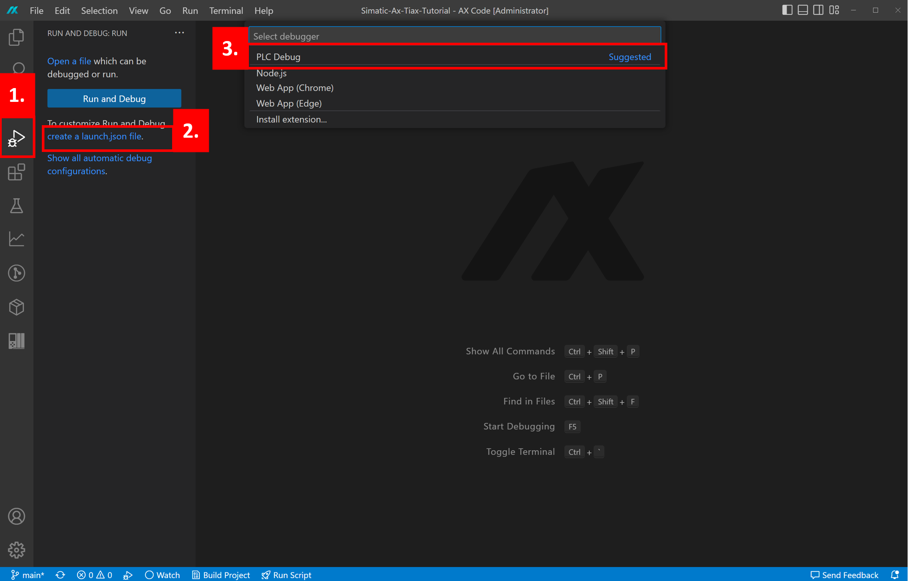
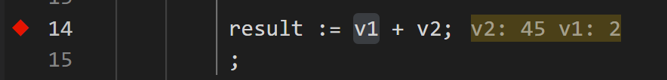

# 5. Debugging the AX library in the PLC

## :mortar_board: Goal for this training chapter :mortar_board:

After this training chapter, you will:

- learn what the requirements in your TIA project are for monitoring your library with AX
- learn how to setup the debugger in AX
- Be familair with monitoring variables in your code

### :raised_hands: Requirements for debugging (hands-on) :raised_hands:

1. The AX application must be build with the `--debug` argument in the `apax.yml`. Check is this is true for your project. If the argument is not yet present add the following line to the `apax.yml` and rebuild the library.

```yaml
variables:
  APAX_BUILD_ARGS:
    - "--debug"
```

2. Rebuild and download the application to the target.

### :raised_hands: Setting up the debugger in AX (hands-on) :raised_hands:

> Note: The latest SDK allready creates the required `launch.json` file in the `.vscode` folder. The next steps are no longer required.
1. Open the Debug tab
2. Press the `Create a launch.json file` link
3. Select PLC Debug
4. A new file `launch.json` file will be created in the `.vscode` folder



> Note: the `launch.json` file should be sufficient as is, unless the IP of the target is different.

### :raised_hands: Start debugging (hands-on):raised_hands:

1. Add logpoints to your code at the locations where you want to take a closer look by **right clicking** a variable name and select **Add to logpoint** for example **count_value** and **power_value** in the`program.st` file.
2. Start debugging by pressing *F5*, the actual values of the logpoints should be displayed

   

> Note: If issues occur, make sure that your set pg/pc interface is correctly configured.

### :raised_hands: Tracing variables (hands-on):raised_hands:

1. To enable the tracing ability of AX create a new file in the following structure `.ax\plc\plc_1.yml`
2. This file should contain the following;
   ```host: 192.168.0.1```
3. Save and close the file and go the **Tracing** panel.
4. Click the **Add configuration** button, a new file will be created, in the **signals** section add both **count_value** and **power_value**.
5. In the **tracing** panel click **pin plc** and select **plc_1** from the prompt.
6. Right click on the **plc_1** entry and select **install job**, select the created trace job.
7. Right click on the **example** trace entry and select enable trace
8. Right click on the **example** trace entry and select **open as..>live graph**, this should open the live trace

## :mortar_board: Summary :mortar_board:

Goal reached? Check yourself...

- you know the requirements for monitoring your library with AX ✔
- you learned to setup the debugger in AX ✔
- you got familiar with monitoring variables in your code from AX ✔

Check out the official docs [AX docs](https://console.simatic-ax.siemens.io/docs/ax2tia/debugging_workflow)

[Continue with next chapter](./6-goodluck.md)
[Back to overview](./../README.md)
