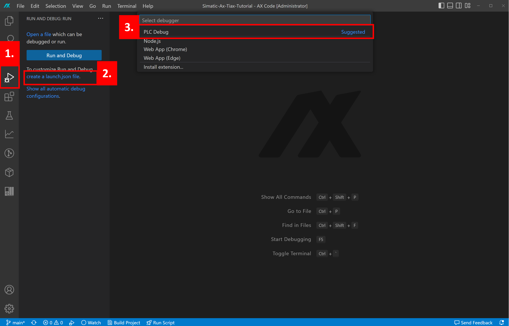

# 5. Debugging the AX library in the PLC

## :mortar_board: Goal for this training chapter :mortar_board:

After this training chapter, you will:

- learn what the requirements in your TIA project are for monitoring your library with AX
- learn how to setup the debugger in AX
- Be familair with monitoring variables in your code

### :raised_hands: Requirements for debugging (hands-on) :raised_hands:

1. The TIAX Library must be build with the `--debug` argument in the `apax.yml`. Check is this is true for your project. If the argument is not yet present add the following line to the `apax.yml` and rebuild the library.

```yaml
variables:
  APAX_BUILD_ARGS:
    - "--debug"
```

2. The TIA portal Library blocks **must** be implemented in a **software unit** in the TIA project, AX library blocks implemented in the regular programming folder **cannot** be monitored with the AX IDE.
3. In the TIA Portal project create a new Software Unit and call it AX
4. Implement the `add` function in a OB inside of the newly created Software Unit

   
5. Start PLCSIM Advanced in TCP/IP mode (or connect a physical PLC) and download the TIA project to the PLC instance.


### :raised_hands: Setting up the debugger in AX (hands-on) :raised_hands:

1. Open the Debug tab
2. Press the `Create a launch.json file` link
3. Select PLC Debug
4. A new file `launch.json` file will be created in the `.vscode` folder



5. Copy the code below and replace everything in the `launch.json` file

```json
{
    // Use IntelliSense to learn about possible attributes.
    // Hover to view descriptions of existing attributes.
    // For more information, visit: https://go.microsoft.com/fwlink/?linkid=830387
    "version": "0.2.0",
    "configurations": [
        {
            "name": "Debug live on PLC",
            "type": "plc-debug",
            "request": "launch",
            "program": "${workspaceFolder}",
            "ip": "192.168.0.1",
            "symbolsPath": "${workspaceFolder}/bin/1500/simatic-ax-workshop-nl.lib"
        }
    ]
}

```

### :raised_hands: Start debugging (hands-on):raised_hands:

1. Add logpoints to your code at the locations where you want to take a closer look by **right clicking** a variable name and select `Add to logpoint` For example **v1** and **v2** in the `math.st` file.
2. Start debugging by pressing *F5*, the actual values of the logpoints should be displayed
> Note: Make sure that your set pg/pc interface is correctly configured.

   

## :mortar_board: Summary :mortar_board:

Goal reached? Check yourself...

- you know the requirements for monitoring your library with AX ✔
- you learned to setup the debugger in AX ✔
- you got familiar with monitoring variables in your code from AX ✔

Check out the official docs [AX docs](https://console.simatic-ax.siemens.io/docs/ax2tia/debugging_workflow)

[Back to overview](./../README.md)
